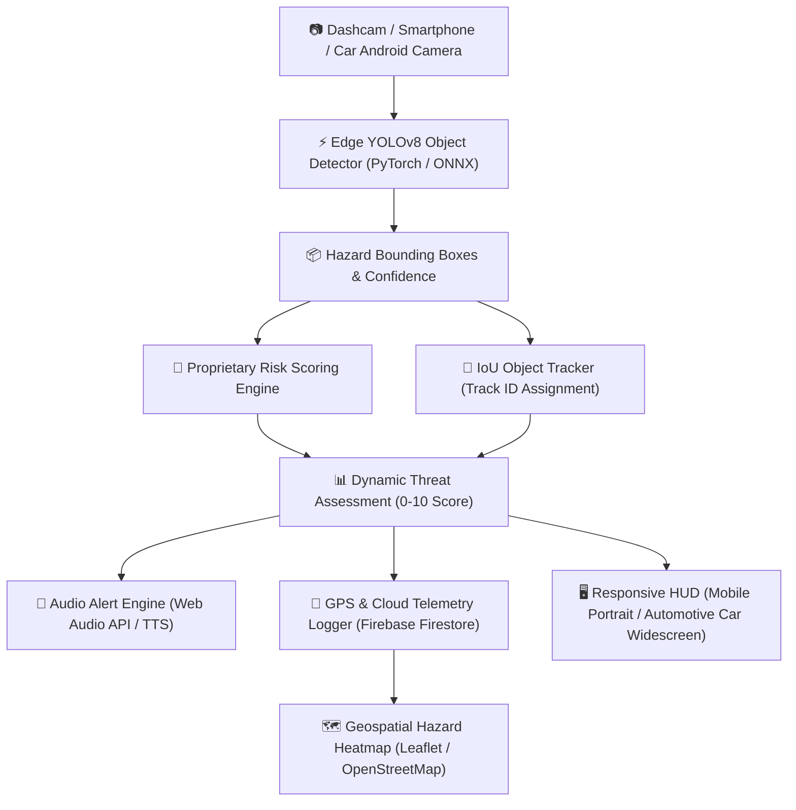

# 🛡️ RoadShield AI: Autonomous Road Hazard Detection, Real-time Severity Risk Scoring & Telemetry System

---

## 📌 Executive Summary & Project Vision

**RoadShield AI** is an end-to-end, edge-compatible artificial intelligence system designed to autonomously detect, track, score, and log road infrastructure hazards in real-time. Operating from standard dashcams, smartphone cameras, or **Car Android Head-Units (Infotainment Systems)**, RoadShield AI protects drivers from catastrophic accidents caused by road defects like **open manholes, deep potholes, road cracks, fallen debris, and unmarked speed bumps**.

Unlike traditional vision models that merely draw bounding boxes around defects, RoadShield AI integrates a **proprietary dynamic risk-scoring mathematical engine** that computes real-time threat levels based on defect type, proximity/size, frame position, and detection confidence. It includes a **persistent object-tracking engine** (IoU-based) to eliminate duplicate notifications, a **voice audio alert system**, **GPS location logging**, and a **cloud-synced geospatial hazard heatmap** (Firebase & OpenStreetMap).

The entire system is cross-platform: it runs as a **high-throughput Python GPU pipeline**, a **100% offline Web Application** (using ONNX Runtime Web via WebGL/WASM), and a **standalone native Android APK** engineered specifically for both **Smartphones** and **Car Android Touchscreen Head-Units**.

---

## 🏗️ System Architecture & Workflow



---

## 🌟 Key Features & Innovations

1. **High-Precision Multi-Class YOLOv8 Detection**:
   - Detects 7 critical road hazard classes: `open_manhole`, `pothole`, `manhole`, `speed_bump`, `unmarked_bump`, `crack`, and `debris`.
   - Trained on multi-dataset aggregations curated from Roboflow and custom annotated datasets.

2. **Proprietary Real-Time Risk Scoring Engine**:
   - Dynamic score formula ($0.0 \text{ to } 10.0$) modulating class baseline severity with relative visual size (proximity) and vertical position in camera frame.
   - Categorizes threats into four actionable severity tiers: **CRITICAL** ($\ge 7.5$), **HIGH** ($\ge 5.0$), **MEDIUM** ($\ge 2.5$), and **LOW** ($< 2.5$).

3. **Multi-Camera & Dual Dashcam Source Selector**:
   - **Dynamic Camera Enumeration**: Automatically detects all video input sources connected to the hardware (Front Dashcam, Rear Dashcam, External USB Webcams, and Smartphone Cameras).
   - **Seamless Camera Dropdown & Toggle**: Integrated camera dropdown in the live HUD and Settings modal allows driver to switch camera feed on the fly between Front and Rear road views. Supports dual-dashcam setups on Android Head-Units via USB OTG hubs.

4. **Car Android Head-Unit & Mobile Dual Responsive HUD**:
   - **Automotive Widescreen Mode (Car Head Units / Tablets)**: Automatically switches to a 2-column split-screen layout (`@media (orientation: landscape)`). The camera feed occupies the left ~62% with zero aspect-ratio distortion (`object-fit: contain`), while stats and the Live Hazard Alert Log are pinned on the right ~38%. Features enlarged touch targets for safe driver interaction.
   - **Smartphones Mode (Narrow Portrait)**: Maintains a sleek single-column portrait stack with camera on top and live telemetry below.

5. **Frame-to-Frame Hazard Tracking & Deduplication**:
   - IoU (Intersection over Union) matching tracks moving/stationary defects across consecutive frames.
   - Assigns unique persistent Track IDs (`#1`, `#2`, etc.) and prevents audio notification spamming.

6. **100% Offline Edge Execution (ONNX Runtime Web)**:
   - PyTorch models exported to optimized ONNX format (`opset=12`).
   - Runs directly in browser/mobile webview using WASM and WebGL hardware acceleration — **no server connection required for inference**.

7. **Integrated Driver HUD & Multi-Mode Web Suite**:
   - **Dashcam Live**: Real-time webcam/car camera feed overlay with live FPS counters, active hazard counts, risk badges, and multi-camera source switcher.
   - **Video Upload**: Frame-by-frame analysis of pre-recorded dashcam footage.
   - **Test Suite**: Instant batch image evaluation with complete image overlay preservation under detection bounding boxes.
   - **Analytics**: Live statistical charts of detected hazard frequencies and risk distributions.
   - **Hazard Map**: Interactive map displaying real-time logged hazards with lat/lng coordinates and color-coded markers.

7. **Automated Pure-Python Android APK Build Engine**:
   - Custom build system (`build_apk.py`) that automatically downloads OpenJDK 17, Android SDK tools (Platform 34), and Gradle 8.5 to compile a native Android APK wrapper (`roadshield-ai.apk`) with dynamic orientation support (`android:screenOrientation="unspecified"`).

---

## 📐 Mathematical & Algorithmic Foundations

### 1. Dynamic Risk Scoring Algorithm (`risk_scoring.py` / `mobile_engine.js`)

The risk score $R$ is calculated as follows:

$$\text{Raw Score} = S_{\text{base}} \times \left( 0.5 + 0.3 \times F_{\text{size}} + 0.2 \times F_{\text{pos}} \right)$$

$$\text{Final Risk Score } R = \min\left( \text{Raw Score} \times C, 10.0 \right)$$

Where:
- $S_{\text{base}}$: Base severity score assigned per hazard class (0.0 to 10.0).
- $F_{\text{size}}$: Relative area factor = $\min\left(\frac{\text{Bounding Box Area}}{\text{Frame Area} \times 0.15}, 1.0\right)$. Hazards taking $>15\%$ of frame max out at $1.0$.
- $F_{\text{pos}}$: Relative position factor = $\frac{y_{\max}}{\text{Frame Height}}$. Hazards lower in the frame (closer to the car) approach $1.0$.
- $C$: Detection confidence score ($0.0 \text{ to } 1.0$).

#### Class Severity Weight Matrix ($S_{\text{base}}$)

| Class Name | Severity Weight ($S_{\text{base}}$) | Description & Threat Context |
| :--- | :---: | :--- |
| `open_manhole` | **10.0** | Extreme emergency — can cause vehicle flip or suspension collapse. |
| `pothole` | **6.0** | High risk — causes severe wheel/tire damage and vehicle instability. |
| `debris` | **5.5** | High risk — obstacle in lane, sharp metal/wood objects. |
| `unmarked_bump` | **5.0** | Moderate/High risk — sudden lift at high speed causing loss of control. |
| `manhole` | **3.0** | Low/Moderate risk — covered manhole cover. |
| `crack` | **2.5** | Low risk — road surface degradation, long-term hazard. |
| `speed_bump` | **2.0** | Low risk — standard marked speed bump. |

---

### 2. Hazard Tracking & IoU Matcher (`tracker.py` / `mobile_engine.js`)

For bounding boxes $B_1 = [x_1, y_1, x_2, y_2]$ and $B_2 = [x_1', y_1', x_2', y_2']$:

$$\text{IoU}(B_1, B_2) = \frac{\text{Area}(B_1 \cap B_2)}{\text{Area}(B_1 \cup B_2)}$$

- If $\text{IoU} \ge 0.3$, the existing track state is updated with new coordinates and incremented hit count.
- Unmatched detections spawn a new `Track` instance with a new unique ID.
- Tracks unobserved for $>15$ consecutive frames (`max_age`) are pruned from memory.

---

## 📁 Repository Directory Structure

```
d:\RoadShield AI
│
├── 📜 README.md                    # Quick start documentation
├── 📜 PROJECT_DOCUMENTATION.md     # Detailed comprehensive project master documentation
│
├── 🧠 Python AI & Backend Core
│   ├── train_yolo.py               # Fine-tunes YOLOv8 model on merged datasets
│   ├── onnx_exporter.py            # Converts PyTorch (.pt) weights to ONNX format
│   ├── risk_scoring.py             # Proprietary Risk Scoring mathematical module
│   ├── tracker.py                  # Real-time IoU-based multi-object hazard tracker
│   ├── inference.py                # Desktop Python inference on video / images (OpenCV GUI)
│   ├── check_gpu.py                # Verifies CUDA PyTorch GPU availability (e.g. RTX 5050)
│   └── yolov8s.pt                  # Pretrained YOLOv8 small base weights
│
├── 📊 Dataset Download & Merging Pipeline
│   ├── download_all_datasets.py    # Fetches Roboflow road defect datasets
│   ├── download_more_datasets.py   # Fetches additional pothole/manhole datasets
│   ├── check_dataset.py            # Validates dataset structure and label integrity
│   ├── check_all_datasets.py        # Audits all dataset directories
│   ├── check_new_datasets.py       # Audits newly downloaded datasets
│   ├── merge_datasets.py           # Unifies multi-source datasets into single YOLO schema
│   ├── verify_merged.py            # Verifies class distribution in merged dataset
│   ├── merged_dataset/             # Consolidated YAML dataset ready for YOLO training
│   └── Road-Defects-1/             # Source dataset directory
│
├── 🌐 Mobile & Web Application (offline HUD)
│   ├── mobile_app/
│   │   ├── index.html              # Modern responsive HUD UI layout
│   │   ├── app.js                  # Main controller, ONNX inference pipeline & UI state
│   │   ├── app.css                 # Dark glassmorphism HUD styles & animations
│   │   ├── mobile_engine.js        # JavaScript port of RiskScorer & HazardTracker
│   │   ├── gps.js                  # Geolocation tracker & GPS status manager
│   │   ├── hazard-logger.js        # Firebase Firestore telematics telemetry logger
│   │   ├── maps-dashboard.js       # Leaflet.js interactive hazard map renderer
│   │   ├── firebase-config.js      # Firebase credentials & Firestore initializer
│   │   ├── ort.min.js              # Offline ONNX Runtime Web engine (WASM/WebGL)
│   │   └── assets/
│   │       └── best.onnx           # Exported ONNX AI Model (YOLOv8 Edge)
│   └── download_onnxruntime_web.py # Fetches latest ort.min.js for browser offline use
│
├── 📱 Native Android APK Build Infrastructure
│   ├── build_apk.py                # Automated Python script to download SDK/JDK/Gradle & build APK
│   ├── roadshield-ai.apk           # Compiled native Android APK application
│   ├── android_builder/            # Standalone build tools (JDK 17, Android SDK 34, Gradle 8.5)
│   └── android_project/            # Generated Gradle Android Native project source files
│       └── app/src/main/
│           ├── java/com/roadshield/ai/MainActivity.java  # Custom Android WebView client & camera permissions
│           └── AndroidManifest.xml                        # Android app manifest with permissions
│
└── 🏋️ Training Runs & Output Artifacts
    ├── runs/                       # Ultralytics training outputs and best.pt weights
    └── inference_outputs/          # Output images/videos from inference.py
```

---

## 💻 Complete Command Reference & Execution Guide

### 1. Environment Setup & Hardware Verification

Ensure Python 3.10+ and PyTorch with CUDA support are installed.

```powershell
# Verify GPU acceleration (CUDA)
python check_gpu.py
```

---

### 2. Dataset Management & Consolidation

Download and merge multi-source datasets into unified 7-class YOLO schema:

```powershell
# Download datasets from Roboflow / source repositories
python download_all_datasets.py
python download_more_datasets.py

# Audit raw datasets
python check_dataset.py
python check_all_datasets.py

# Merge all raw datasets into unified YOLO structure in /merged_dataset
python merge_datasets.py

# Verify consolidated dataset integrity and class distributions
python verify_merged.py
```

---

### 3. Model Training (YOLOv8)

Train fine-tuned YOLOv8 model using GPU acceleration:

```powershell
# Launch YOLOv8 fine-tuning (100 epochs, imgsz=640, batch=16)
python train_yolo.py
```

*Trained weights will be saved to `runs/detect/runs/road_hazard_v2/weights/best.pt`.*

---

### 4. ONNX Export for Edge Web & Mobile

Export trained PyTorch weights to ONNX format and sync to mobile web app:

```powershell
# Export best.pt -> mobile_app/assets/best.onnx (opset 12)
python onnx_exporter.py

# Download offline ONNX Runtime Web library (ort.min.js)
python download_onnxruntime_web.py
```

---

### 5. Desktop Python Inference & Testing

Run real-time inference with OpenCV display, IoU tracking, and risk scoring:

```powershell
# Run risk scoring test script
python risk_scoring.py

# Test tracker logic
python tracker.py

# Run full inference pipeline on video or image
python inference.py
```

---

### 6. Running Web Application HUD Locally

Host the `mobile_app` folder via local HTTP server for testing in desktop browser or mobile browser:

```powershell
# Start local HTTP server on port 8000
python -m http.server 8000 --directory mobile_app
```

Then open `http://localhost:8000` in Google Chrome or Microsoft Edge.

---

### 7. Building Standalone Native Android APK

Build `roadshield-ai.apk` automatically without installing Android Studio manually:

```powershell
# Automated Android APK compilation pipeline
python build_apk.py
```

Upon completion, `roadshield-ai.apk` (53.7 MB) will be generated in the root directory `d:\RoadShield AI\roadshield-ai.apk`.

---

## 📲 Android & Car System Deployment Guide

### A. Installing Standalone APK on Android Phone / Car Android Head-Unit
1. Transfer `roadshield-ai.apk` to an Android phone or USB flash drive for Car Head-Unit.
2. Enable **"Install from Unknown Sources"** in Android Settings.
3. Install `roadshield-ai.apk`.
4. Open **RoadShield AI** app and grant requested permissions:
   - 📷 **Camera Permission** (for live dashcam feed processing).
   - 📡 **Location Permission** (for GPS telemetry & hazard map logging).
5. Mount smartphone on dashboard/windshield mobile holder facing the road.
6. Select preferred camera source (e.g. `🚗 Dashcam Rear / Main Camera` or `🚘 Dashcam Front / Interior`) from the **Camera Select Dropdown** or **Switch Camera 🔄** button.

### B. Displaying App via Android Auto (CarConnect)
Android Auto blocks side-loaded 3rd-party APK icons by default on car screens. To run/mirror RoadShield AI on Android Auto:
1. Open **Settings** on Android Phone $\rightarrow$ search for **Android Auto**.
2. Scroll to **Version** at the bottom and tap it **10 times** to enable Developer Options.
3. Tap 3-dots menu top-right $\rightarrow$ open **Developer settings**.
4. Check and enable **"Unknown sources"** (allows side-loaded apps on Android Auto).
5. Reconnect phone to car via USB/Wireless CarConnect.
*(Note: For optimal hazard detection, phone must be mounted on windshield/dashboard so the camera maintains an unobstructed view of the road).*

---

## ☁️ Firebase Cloud Telemetry & Hazard Map Integration

RoadShield AI automatically syncs detected hazards with Firebase Firestore when GPS is enabled:

### Firestore Document Data Schema:
```json
{
  "hazard_id": "trk_1727083200_1",
  "class_name": "open_manhole",
  "risk_score": 9.45,
  "risk_level": "CRITICAL",
  "latitude": 28.6139,
  "longitude": 77.2090,
  "timestamp": "2026-09-23T14:48:35Z",
  "confidence": 0.88
}
```

The embedded **Hazard Map** in the web HUD uses **Leaflet.js** and **OpenStreetMap** to render color-coded pins:
- 🔴 **Red Marker**: CRITICAL Risk ($\ge 7.5$)
- 🟠 **Orange Marker**: HIGH Risk ($\ge 5.0$)
- 🟡 **Yellow Marker**: MEDIUM Risk ($\ge 2.5$)
- 🟢 **Green Marker**: LOW Risk ($< 2.5$)

---

## 🔬 Key Performance Metrics & Benchmarks

| Parameter | Performance Benchmark |
| :--- | :--- |
| **Model Base** | YOLOv8s (22.5 MB PyTorch / 43 MB ONNX) |
| **Edge Frame Rate (Desktop RTX GPU)** | 85 - 120 FPS |
| **Edge Frame Rate (WebGL Browser / WASM)** | 25 - 45 FPS |
| **Edge Frame Rate (Android Mobile WebGL)** | 20 - 35 FPS |
| **Edge Frame Rate (Car Android Head-Units)** | 20 - 30 FPS |
| **Risk Computation Latency** | $< 0.2 \text{ ms}$ per box |
| **Tracking IoU Overhead** | $< 0.5 \text{ ms}$ per frame |
| **Supported Hazard Classes** | 7 Classes (`open_manhole`, `pothole`, `manhole`, `speed_bump`, `unmarked_bump`, `crack`, `debris`) |

---

## 🛠️ Summary of Key Technical Achievements

- **Zero-Dependency Edge AI**: Runs end-to-end vision AI without requiring internet connection for model inference.
- **Automotive & Mobile Dual-Mode HUD**: Fluidly adapts between narrow smartphone portrait stack and widescreen 2-column car head-unit dashboard via pure CSS media query layout reflow.
- **Cross-Platform Parity**: Python engine and JavaScript engine share 100% identical risk-scoring formulas and IoU tracking algorithms.
- **Fully Automated Build System**: Python script automates complex Android SDK/JDK dependencies and compiles APK directly.

---
*RoadShield AI — Protecting Roads, Saving Lives through Edge Intelligence.*

